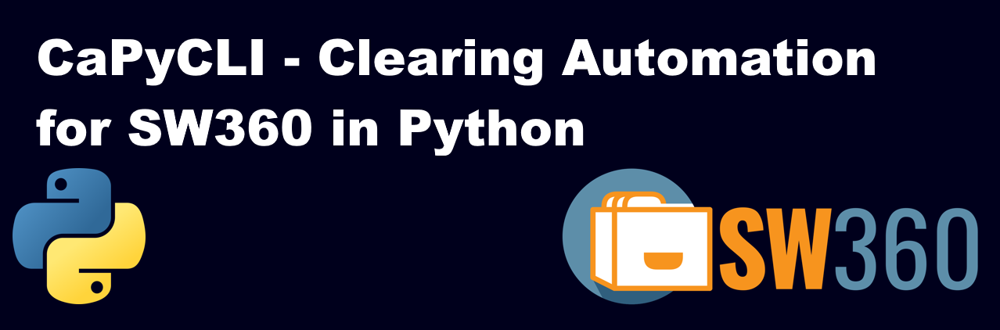

<!--
# SPDX-FileCopyrightText: (c) 2018-2023 Siemens
# SPDX-License-Identifier: MIT
-->



# CaPyCli - Clearing Automation Python Command Line Tool for SW360

[](https://github.com/sw360/capycli/blob/main/License.md)
[](https://pypi.org/project/capycli/)
[](https://www.python.org/doc/versions/)
[](https://github.com/sw360/capycli/actions/workflows/static-checks.yml)
[](https://github.com/sw360/capycli/actions/workflows/unit-tests.yml)
[](https://github.com/sw360/capycli/actions/workflows/unit-tests.yml)
[](https://github.com/tngraf/Tethys.Dgml/blob/master/SBOM/sbom.cyclonedx.xml)
[](https://api.reuse.software/info/git.fsfe.org/reuse/api)

Python 3 scripts to allow license clearing automation using the
[SW360](https://github.com/eclipse/sw360) software catalogue.

## What is SW360?

[SW360](https://github.com/eclipse/sw360) is a software component catalogue application designed to
provide a central place for sharing information about software components used by an organization.
It is designed to neatly integrate into existing infrastructures related to the management of
software artifacts and projects by providing separate backend services for distinct tasks and a set
of portlets to access these services. A complete deployment unit exists (vagrant box or docker
container) that contains a complete configuration of all services and portlets.

Companies like Cariad, Siemens or Toshiba use SW360 to track their use of third party software components.

## Why CaPyCli?

SW360 is for software developers and software developers love to automate tasks. The SW360 user
interface is nice if you want to check a project or search for a single component. But if you have
a project with a JavaScript frontend and hundreds of components, you do not want to add all of them
manually. You want to be able to determine your software bill of materials (SBOM) and you want to
map this SBOM to the information that is already available of SW360.

CaPyCli allows you to

* determine your list of dependencies, your software bill of materials (SBOM)
* determine meta-data for the SBOM items and download source files
* map an SBOM to the data available on SW360
* create all missing components and releases
* create a project that contains all releases of your SBOM
* track the progress on license compliance checks
* show information about the project and its releases
* show information about export control information and security vulnerabilities (if tracked via SW360)

## Basic Syntax

```code
CaPyCli command [sub-command...] [options]

Commands and Sub-Commands
    getdependencies     dependency detection specific commands
        Nuget             determine dependencies for a .Net/Nuget project
        Python            determine dependencies for a Python project
        Javascript        determine dependencies for a JavaScript project
        MavenPom          determine dependencies for a Java/Maven project using the pom.xml file
        MavenList         determine dependencies for a Java/Maven project using a Maven command

    bom                 bill of material (SBOM) specific commands
        Show              display contents of a SBOM
        Convert           convert SBOM formats
        Filter            apply filter file to a SBOM
        Check             check that all releases in the SBOM exist on target SW360 instance
        CheckItemStatus   show additional information about SBOM items on SW360
        Map               map a given SBOM to data on SW360
        CreateReleases    create new releases for existing components on SW360
        CreateComponents  create new components and releases on SW360 (use with care!)
        DownloadSources   download source files from the URL specified in the SBOM
        Granularity       check a bill of material for potential component granularity issues
        Diff              compare two bills of material.
        Merge             merge two bills of material.
        Findsources       determine the source code for SBOM items.

    mapping
        ToHtml            create a HTML page showing the mapping result
        ToXlsx            create an Excel sheet showing the mapping result

    moverview
        ToHtml            create a HTML page showing the mapping result overview
        ToXlsx            create an Excel sheet showing the mapping result overview

    project
        Find              find a project by name
        Prerequisites     checks whether all prerequisites for a successfull
                          software clearing are fulfilled
        Show              show project details
        Licenses          show licenses of all cleared compponents
        Create            create or update a project on SW360
        Update            update an exiting project, preserving linked releases
        GetLicenseInfo    get license info of all project components
        CreateReadme      create a Readme_OSS
        Vulnerabilities   show security vulnerabilities of a project
        ECC               Show export control status of a project

Options:
  command                                           command and subcommand to process
  -h, --help                                        show a help message and exit
  -i INPUTFILE, --inputfile INPUTFILE               input file to read from
  -ri RAW_INPUT, --raw-input RAW_INPUT              raw data input file to parse repository urls
  -o OUTPUTFILE, --outputfile OUTPUTFILE            output file to write to
  -filterfile FILTERFILE                            filter file to use
  -v VERBOSE                                        be verbose
  -t SW360_TOKEN, --token SW360_TOKEN               use this token for access to SW360
  -oa, --oauth2                                     this is an oauth2 token
  -url SW360_URL                                    use this URL for access to SW360
  --nocache NOCACHE                                 do not use component cache
  -cf CACHEFILE, --cachefile CACHEFILE              cache file name to use
  -rc REFRESH_CACHE, --refresh_cache REFRESH_CACHE  refresh component cache
  -sc, --similar                                    look for components with similar name
  -ov CREATE_OVERVIEW, --overview CREATE_OVERVIEW   create an mapping overview JSON file
  -mr WRITE_MAPRESULT, --mapresult WRITE_MAPRESULT  create a JSON file with the mapping details
  -name                                             name of the project
  -version                                          version of the project
  -id ID                                            SW360 id of the project, supersedes name and 
                                                    version parameters
  -ncli NCLI, --no-overwrite-cli NCLI               do not overwrite existing CLI files
  -nconf NCONF, --no-overwrite-config NCONF         do not overwrite an existing configuration file
  -dest DESTINATION, --destination DESTINATION      the destination folder
  -source SOURCE                                    source folder or additional source file
  --dbx DBX                                         relaxed handling of debian version numbers
  --download                                        enable automatic download of missing sources
  --search-meta-data SEARCH_META_DATA               search for component meta-data
  -old-version OLD_VERSION                          previous version
  -ex                                               show exit code
  -rr RESULT_REQUIRED                               there must be a clearing result available
  -xml XML                                          use XML format
  -package-source PACKAGE_SOURCE                    URL of the package manager to use
  -all                                              show/use all items
  -format FORMAT                                    format to use (text, json, xml)
  -fe FORCE_EXIT, --forceexit FORCE_EXIT            force a specific exit code
  -m MODE, --mode MODE                              specific mode for some commands
  -if INPUTFORMAT                                   Specify input file format
  -of OUTPUTFORMAT                                  Specify output file format
  -X DEBUG                                          Enable debug output
```

## Use Cases

Over the time we implemented more and more commands with more and more parameters.  
We understand that it is hard for beginners to find the right command for the task
they want to do. Have a look at our [Use Case Overview](UseCaseOverview.md).

## Software Clearing Approaches

From time to time there are questions **why** a command has been implemented in this
specific way or why a command exists at all. Not all organization have the same
approach when doing license compliance. Have a look at our
[Software Clearing Approach Overview](SoftwareClearingApproachOverview.md) to see our
approaches.

## Note about Python Dependency Detection

At the moment there is only support for dependencies defined in a `requirements.txt` file.  
Poetry users can create the `requirements.txt` file via

```sh
poetry export --format requirements.txt -o requirements.txt --without-hashes
```

If you are using pipenv, you can create the `requirements.txt` file via

```sh
pipenv lock -r > requirements.txt
```

If your dependencies are defined in `setup.py` you may take a look at
https://dephell.readthedocs.io/cmd-deps-convert.html or
https://github.com/jazzband/pip-tools#example-usage-for-pip-compile to generate
a `requirements.txt` file.

Probably the best solution is if you enhance CaPyCli to support poetry, pipenv or setup.py
directly and open a merge request.

## Examples

### Find project by name

Command:

```sh
capycli project find -name "tr-card"
- or -
python -m capycli project find -name tr-card
```

Result

```sh
CaPyCli - Find a project by name

  Searching for projects by name
    TR-Card, 1.0 => ID = ff697cd18fe178b26fc601b60e00fcdf
```

More examples and usage notes can be found in [examples.md](examples.md).

## Prerequisites

* Python 3
* A SW360 read (and write) token, see next section.

## API Access

Access to the SW360 REST API requires an access token.
The token can be requested on SW360/Preferences/REST API Token.

The scripts in this repository expect, that a valid token
is stored in the environment variable ``SW360ProductionToken``.
Alternatively you can specify a token using the `-t` option.

For proper access to an SW360 instance the correct url must be own.
The SW360 url can be specified on the commandline with the `-url`
parameter, via the environment variable ``SW360ServerUrl`` or in the
config file (`.capycli.cfg`).

## SBOM Format

The software bill of materials (SBOM) is a crucial information for most operations.
There is no common description what a bill of materials should contain.
There are different formats available, for example the SBOM of CyCloneDX,
nevertheless most tools have their own SBOM format.
We have decided also to have our own flavor of CycloneDX, see [SBOM](Readme_BOM.md),
focused on the information we need to handle components, releases and projects
on SW360. It is a simple JSON format. CaPyCli reads or writes exactly the
information that is needed.
Conversion support from or to our SBOM format is available.
For converting CycloneDX (XML) to JSON or for converting SPDX SBOMs, we like
to refer you to the oepn source tools from [CycloneDX](https://cyclonedx.org/).

## Mapping a SBOM to SW360

SBOM mapping is described in an extra file, see [SBOM Mapping](Readme_Mapping.md).

## Project Management

This is a Python project managed using ```Poetry```.

## Installation

### From PyPi

* using `pip`:

  ```shell
  pip install capycli
  ```

## Copyright & License

Copyright 2018-2023 Siemens

This program and the accompanying materials are made
available under the terms of the MIT License.  
SPDX-License-Identifier: MIT
